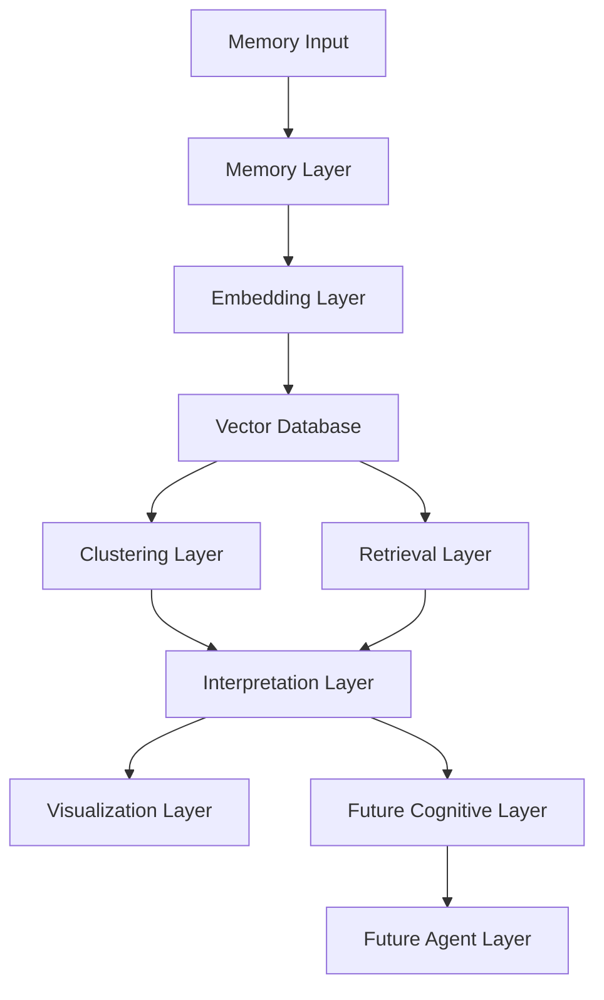
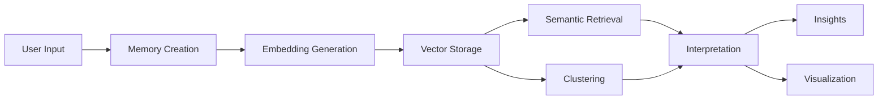

# Architecture

## Overview

MNEMOS is designed as a modular Artificial Semantic Memory Architecture.

The system is built around a central idea:

> Every memory is transformed into semantic representations that can be connected, searched, clustered, interpreted, and eventually reorganized.

The architecture follows a layered design to allow future expansion while maintaining clear separation of responsibilities.

---

# High-Level Architecture



---

# System Layers

The architecture is divided into independent modules.

Each module has a specific responsibility and can evolve independently.

---

# 1. Memory Layer

## Purpose

Responsible for memory creation, storage, metadata management, and memory lifecycle operations.

## Responsibilities

* Create memories
* Store metadata
* Manage timestamps
* Handle tags
* Handle memory updates
* Handle memory deletion

## Input

```text
User Memory
```

Example:

```text
"I studied Machine Learning tonight."
```

## Output

```json
{
  "id": "uuid",
  "timestamp": "2026-06-11",
  "content": "I studied Machine Learning tonight.",
  "tags": ["study"]
}
```

---

# 2. Embedding Layer

## Purpose

Convert memories into semantic vector representations.

This layer is responsible for transforming natural language into mathematical representations that preserve meaning.

## Responsibilities

* Text preprocessing
* Embedding generation
* Semantic encoding
* Vector normalization

## Technologies

* Sentence Transformers
* all-MiniLM-L6-v2

## Input

```text
I studied Machine Learning tonight.
```

## Output

```text
[0.123, 0.982, -0.422, ...]
```

---

# 3. Vector Database Layer

## Purpose

Store semantic vectors and provide fast semantic retrieval.

## Responsibilities

* Store embeddings
* Store metadata
* Index vectors
* Perform nearest-neighbor search
* Enable semantic retrieval

## MVP Technology

* ChromaDB

## Future Technologies

* FAISS
* Qdrant
* Weaviate

---

# 4. Retrieval Layer

## Purpose

Retrieve memories based on meaning rather than exact words.

## Responsibilities

* Similarity search
* Ranking
* Top-k retrieval
* Semantic filtering

## Search Process


Example:

Query:

```text
Artificial Intelligence
```

Retrieved Memories:

```text
Machine Learning
Neural Networks
Python for AI
```

---

# 5. Clustering Layer

## Purpose

Discover thematic groups automatically.

The clustering system identifies memories that belong to similar conceptual domains.

## Responsibilities

* Cluster generation
* Topic discovery
* Group analysis
* Pattern extraction

## Algorithms

### K-Means

Used for:

* Fixed cluster counts
* Initial experimentation

### DBSCAN

Used for:

* Unknown cluster counts
* Noise detection
* Natural grouping

## Example

```text
Cluster A

- AI
- Machine Learning
- Python

Cluster B

- Gym
- Fitness
- Exercise
```

---

# 6. Interpretation Layer

## Purpose

Transform data into meaning.

This layer represents the first step toward cognitive behavior.

## Responsibilities

* Pattern detection
* Theme analysis
* Insight generation
* Relationship identification

## Example Insights

```text
Artificial Intelligence is the most frequent topic.

Three major semantic groups were identified.

Strong relationships were detected between Python and Machine Learning.
```

---

# 7. Visualization Layer

## Purpose

Represent memory structures visually.

## Responsibilities

* Cluster visualization
* Semantic network visualization
* Relationship graphs

## Technologies

* NetworkX
* Matplotlib

## Example

```text
Python
   |
Machine Learning
   |
Artificial Intelligence
```

---

# Future Layers

The following components are not part of the MVP but are planned for future versions.

---

# 8. Knowledge Graph Layer

## Purpose

Store explicit relationships between concepts.

## Example

```text
Python
 └── used_for
      └── Machine Learning
```

## Planned Technology

* Neo4j

---

# 9. Cognitive Layer

## Purpose

Introduce neuroscience-inspired memory behaviors.

## Planned Features

* Memory consolidation
* Memory decay
* Importance reinforcement
* Association spreading
* Dynamic memory restructuring

---

# 10. Agent Layer

## Purpose

Enable autonomous cognitive processes.

## Planned Agents

### Memory Agent

Manages memory structures.

### Reflection Agent

Analyzes stored knowledge.

### Analysis Agent

Discovers patterns and anomalies.

### Organization Agent

Reorganizes memory networks.

---

# Data Flow

The complete data flow of MNEMOS is:



---

# MVP Scope

The MVP includes:

* Memory Layer
* Embedding Layer
* Vector Database Layer
* Retrieval Layer
* Clustering Layer
* Interpretation Layer
* Visualization Layer

Everything else is considered future research and development.

---

# Architectural Principles

MNEMOS follows the following principles:

* Modular Design
* Separation of Concerns
* Scalability
* Extensibility
* Research-Oriented Development
* Cognitive Inspiration
* Explainability

Every future feature must integrate into the architecture without requiring major redesigns.

The architecture is intentionally designed as a long-term foundation for experimentation in artificial memory systems.
