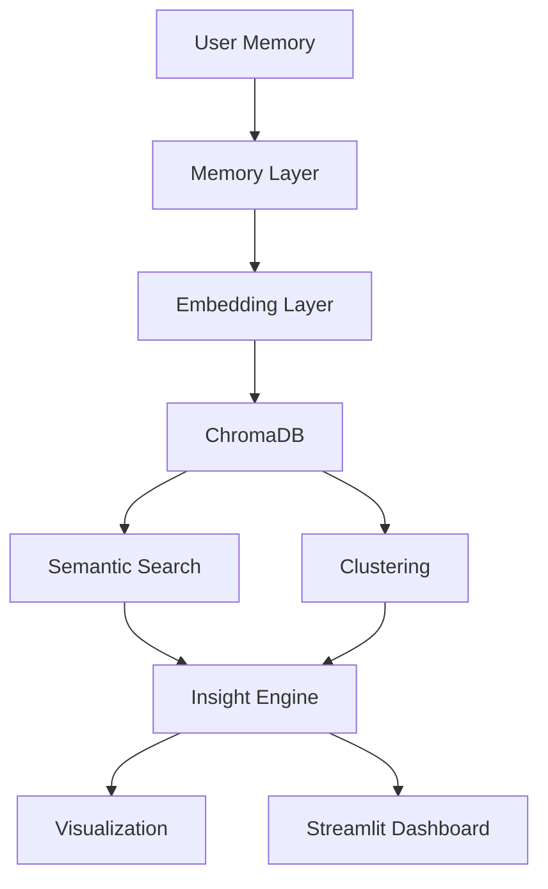

# MVP Specification

## Overview

The MNEMOS MVP (Minimum Viable Product) represents the first functional implementation of the Artificial Semantic Memory Architecture.

The purpose of the MVP is not to implement the complete vision of MNEMOS.

Instead, it aims to validate the core hypothesis of the project:

> Information can be transformed into semantic representations that allow artificial systems to discover relationships, organize knowledge, and generate insights beyond traditional storage mechanisms.

The MVP serves as the foundation for all future versions of the system.

---

# MVP Goals

The MVP must demonstrate the following capabilities:

* Memory storage
* Semantic encoding
* Vector-based retrieval
* Semantic search
* Automatic clustering
* Insight generation
* Knowledge visualization

If these objectives are achieved, the MVP will successfully validate the core architecture of MNEMOS.

---

# Scope

## Included

The MVP will include:

### Memory Management

Creation, storage, and retrieval of memories.

### Semantic Embeddings

Transformation of natural language into vector representations.

### Vector Database

Storage of semantic vectors.

### Semantic Search

Meaning-based memory retrieval.

### Memory Clustering

Automatic grouping of semantically related memories.

### Insight Generation

Basic pattern detection and interpretation.

### Visualization

Graphical representation of relationships and clusters.

---

## Excluded

The following features are intentionally excluded from the MVP.

### Knowledge Graphs

Planned for future versions.

### Autonomous Agents

Not part of the MVP.

### Memory Consolidation

Planned for Phase 4.

### Memory Decay

Planned for Phase 4.

### Reflection Engine

Planned for future versions.

### Artificial Dreaming

Research concept only.

### Cognitive Architecture

Future development.

### Multi-Agent Systems

Future development.

### Consciousness Simulation

Out of scope.

---

# Functional Requirements

## FR-01 — Create Memory

The system must allow users to create memories.

### Input

```text
I studied Machine Learning tonight.
```

### Output

A stored memory record containing:

* Unique ID
* Timestamp
* Content
* Optional tags

---

## FR-02 — Generate Embeddings

The system must automatically convert memories into semantic vector representations.

### Model

Sentence Transformers

```text
all-MiniLM-L6-v2
```

### Output

Vector embedding associated with the memory.

---

## FR-03 — Store Embeddings

The system must store embeddings in a vector database.

### Technology

ChromaDB

Stored information:

* Memory content
* Metadata
* Embedding vector

---

## FR-04 — Semantic Search

The system must retrieve memories based on semantic similarity.

### Example

Query:

```text
Artificial Intelligence
```

Possible Results:

```text
Machine Learning
Neural Networks
Python for AI
```

Even if the exact query words are not present.

---

## FR-05 — Clustering

The system must automatically identify groups of related memories.

### Algorithms

* K-Means
* DBSCAN

### Example

Cluster A

```text
Machine Learning
Python
Artificial Intelligence
```

Cluster B

```text
Gym
Workout
Fitness
```

---

## FR-06 — Insight Generation

The system must generate basic interpretations from stored memories.

### Example Insights

```text
Artificial Intelligence is the most common topic.

Three semantic clusters were identified.

Python frequently appears alongside Machine Learning.
```

---

## FR-07 — Visualization

The system must provide visual representations of memory relationships.

### Visualizations

* Cluster maps
* Semantic networks
* Relationship graphs

---

# Non-Functional Requirements

## Performance

Semantic search should return results in under two seconds for the MVP dataset.

---

## Scalability

The architecture should support future migration to:

* FAISS
* Qdrant
* Weaviate

without major redesign.

---

## Modularity

All major components must be isolated into independent modules.

---

## Maintainability

Code must follow:

* SOLID principles
* Type hints
* Documentation standards
* Unit testing

---

# Technology Stack

## Programming Language

```text
Python 3.12
```

---

## AI & NLP

```text
sentence-transformers
```

Model:

```text
all-MiniLM-L6-v2
```

---

## Vector Database

```text
ChromaDB
```

---

## Machine Learning

```text
scikit-learn
```

Used for:

* Clustering
* Pattern analysis

---

## Visualization

```text
NetworkX
Matplotlib
```

---

## Interface

```text
Streamlit
```

---

## Data Processing

```text
Pandas
NumPy
```

---

# MVP Architecture



---

# Success Criteria

The MVP will be considered successful if it can:

✅ Store memories

✅ Generate embeddings

✅ Retrieve memories semantically

✅ Group related memories

✅ Generate meaningful insights

✅ Visualize relationships

✅ Demonstrate the core concept of artificial semantic memory

---

# Deliverables

The MVP should produce:

## Source Code

Complete Python implementation.

---

## Documentation

* README
* Vision
* Architecture
* Concepts
* MVP Specification

---

## User Interface

Functional Streamlit dashboard.

---

## Demonstration Dataset

Sample memories for testing.

---

## Visualizations

Semantic network graphs.

Cluster visualizations.

---

# Final Objective

The MVP is not intended to be a complete cognitive architecture.

The MVP exists to validate the foundational idea behind MNEMOS:

> A memory system can organize information through semantic relationships rather than simple storage structures.

Once validated, this foundation will support future development toward more advanced cognitive memory architectures.
